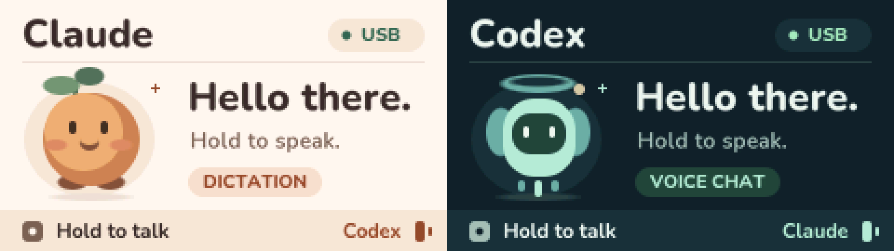

# StickS3 Voice

[](https://github.com/mahsumaktas/sticks3-voice/actions/workflows/ci.yml)
[](LICENSE)

A pocket USB microphone and push-to-talk controller for **M5Stack StickS3**, designed for Claude Code and Codex CLI voice workflows.

[Türkçe](README.tr.md) · [Get started](docs/getting-started.md) · [Compatibility](docs/compatibility.md) · [Privacy](docs/privacy.md)



Hold the front button to send microphone audio. Use the side button to switch between Claude dictation and Codex voice conversation. The screen shows the selected mode, microphone level, and hold time, with original mascots and English or Turkish labels.

- Standard USB audio: **48 kHz, mono, 16-bit PCM**.
- USB keyboard shortcuts; no resident companion app or custom backend.
- Zero audio samples while the front button is released; configurable 90-second default hold limit.
- ESP-IDF 5.4 firmware with pinned component dependencies.
- Backup and verification included in the flash helper by default.

The device does not run an AI model. Claude Code or Codex CLI must provide an available voice feature and its required account/service access. No API key is configured on the device; the host application's authentication and service requirements still apply.

## Controls

| Control | Claude mode | Codex mode |
| --- | --- | --- |
| Hold front **A** | Hold Space and send microphone audio | Send microphone audio |
| Release A | Release Space and send silence | Send silence; the host handles the conversation |
| Press side **B** | Send F8 and select Codex mode | Send F8 and return to Claude mode |

Claude is the initial mode. A mode change is ignored while talking. B is the side button, not power/reset. Select the intended terminal and conversation first: shortcuts go to the foreground application. The device cannot discover sessions, bring an application forward, or confirm that voice mode opened.

Enable hold-to-talk dictation in Claude first. Its auto-submit setting is controlled by the host; disable it if you want to review each transcript before sending. Codex's F8 mapping is based on version 0.159.2; check your installed version. Manual host toggles can make the device's mode differ from the host session. See [compatibility](docs/compatibility.md).

## Build and flash

You need a StickS3, USB data cable, Python 3.12 for host tools, and ESP-IDF 5.4. From the repository root (with `python3` pointing to Python 3.12):

```sh
. "$IDF_PATH/export.sh"
idf.py -C firmware set-target esp32s3
idf.py -C firmware build
python3 -m venv .venv
.venv/bin/python -m pip install --require-hashes -r requirements.txt
.venv/bin/python tools/device.py list
# Enter manual bootloader mode, then use the listed port:
.venv/bin/python tools/device.py flash --port PORT
```

These commands use a POSIX shell; see the setup guide for Windows paths. Flashing replaces the existing firmware. Keep the full-flash backup private and available for recovery. Read the [complete setup and restore instructions](docs/getting-started.md) before the first flash.

## Status

**v0.1.0 is an initial source release.** Earlier internal firmware demonstrated microphone input and both voice workflows on macOS. The public firmware's rebuilt UI, USB identity, and configuration changes still require physical-device acceptance. Windows and Linux are untested. A successful build or CI run does not establish hardware or application compatibility.

## Explore

- [Architecture and configuration](docs/architecture.md)
- [Troubleshooting](docs/troubleshooting.md)
- [Contributing and checks](CONTRIBUTING.md)
- [Releases and verification](docs/releases.md)
- [Security](SECURITY.md) · [Changelog](CHANGELOG.md)

Project code and original project artwork are MIT licensed; Nunito and third-party components retain their own licenses. See [LICENSE](LICENSE), [font license](assets/fonts/OFL.txt), and [third-party notices](THIRD_PARTY_NOTICES.md).

This independent project is not affiliated with or endorsed by M5Stack, Anthropic, or OpenAI. Product names identify hardware and intended host applications.
