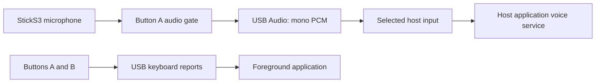

# Architecture

ESP32-S3 firmware combines USB Audio input, HID keyboard reports, and CDC diagnostics. M5Unified/M5GFX provide board and display support; Espressif USB UAC and TinyUSB provide USB support. ESP-IDF is constrained to 5.4; dependencies are recorded in the [manifest](../firmware/main/idf_component.yml) and [lockfile](../firmware/dependencies.lock).

## Audio and controls

Audio is mono signed 16-bit PCM at 48,000 samples per second. USB receives zero samples while A is released. This is a firmware gate, not a physical microphone power switch. The default 90-second limit closes the gate; release and press again to resume.

In Claude mode A also holds/releases Space. In Codex mode A gates audio without that key. B sends a brief F8 press when changing modes in either direction; mode changes are ignored while talking. The device does not query the host. Reset, lost key reports, manual shortcuts, or changing the foreground window can leave device and host states different.

USB exposes microphone input, not speaker output. Responses use the host speaker. The board amplifier and codec DAC output are disabled. External 5 V boost power is disabled, so accessories needing that supply are outside the intended use.

## Configuration and display

Run `idf.py -C firmware menuconfig` to select language, HID usages, and hold limit; rebuild and flash afterward. Defaults are English, Space usage 44, F8 usage 65, and 90 seconds. Configuring a shortcut does not add host discovery or background-window targeting.

The display shows selected mode, gate activity, microphone level, hold time, and USB state. Original mascots and generated text assets belong to the public project. A moving meter shows device input, not confirmation of cloud acceptance.

CDC is for diagnostics, not transcripts. Opening the running port at 1200 baud can request bootloader entry; use 115200 for normal diagnostics. Read [privacy](privacy.md) before sharing logs.
